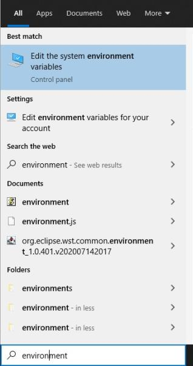
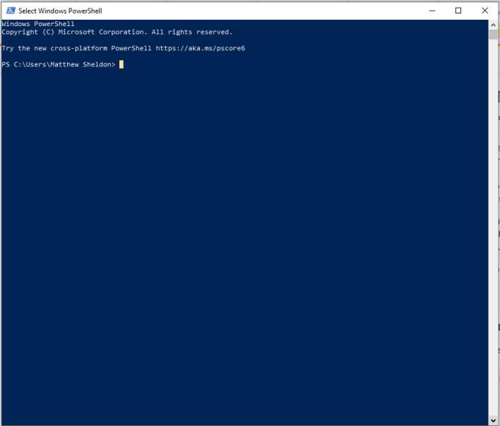
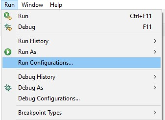
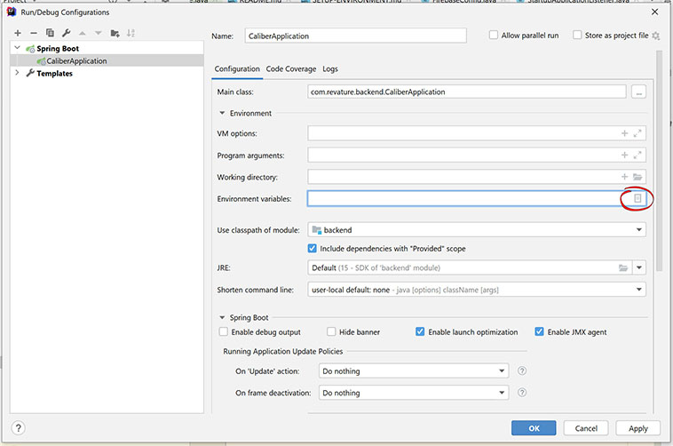
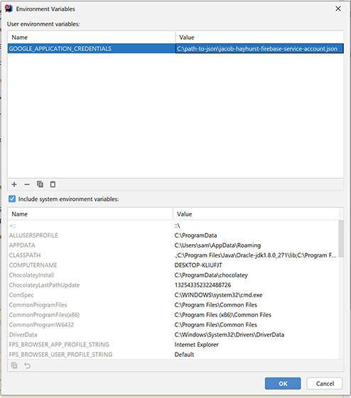

# Setup Environment for Firebase

## Windows

1. In the windows search bar type “environment.”

2. Click on the Edit the system environment variables.

3. That brings up this window. Now click on the button labeled Environment Variables

4. From here click on new under the section for user variables. And fill out the fields as shown filling in the second field with your file path information

5. Click OK and you should be good to go

#### Temporary variable with Powershell

1. First open windows PowerShell.

Then enter the following command
`$env:GOOGLE_APPLICATION_CREDENTIALS=”C:\absolute\path\filename.json”`
where “path” is the absolute path to the service account credentials json file and file name is the name of the file.

If it does not you will need to use the other method.

## Linux / MacOS

To set an environment variable In your .bashrc, .bash_profile, or .profile add
`export GOOGLE_APPLICATION_CREDENTIALS="/absolute/path/to/service-account-file.json"`

### Spring Tool Suite

1. Open Spring Tool Suite.

2. Go to Run-> Run Configurations

3. Select the Environment tab

4. Click on Add

5. Fill out the fields as shown filling out the second field with your file path information

### Visual Studio Code -- MacOS

1. Open Terminal

2. Run `run ~/.bash_profile`

3. Run `open ~/.bash_profile`

4. Type `export + env variable name=PATH`

5. `Export GOOGLE_APPLICATION_CREDENTIALS= "/absolute/path/filename.json"`

   where “path” is the absolute path to the service account credentials json file and file name is the name of the file.

6. Save it (cmd+s) and Quit (cmd+q)

7. Run `source ~/.bash_profile`

8. To verify that it has been added, run `printenv` and check to see if you see the new path and with that you should be good to go.

### IntelliJ IDEA

1. Open IntelliJ IDEA

2. Go to Run-> Edit Configurations... 

3. Select Your Run Configuration.  This should be Spring Boot - CaliberApplication.

4. Click the Edit Environment Variables button.

4. Click the plus button to add a new environment variable.

5. Enter the appropriate values.

##### Other Resources

---

[Firebase Admin SDK setup](https://firebase.google.com/docs/admin/setup)
